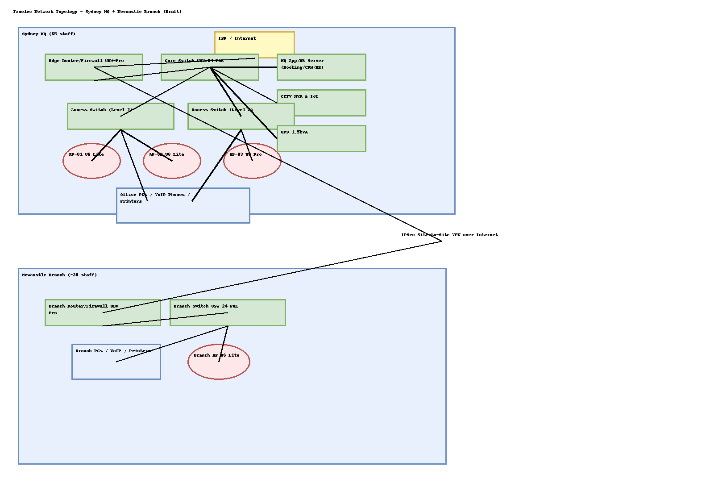

# 4.1 Network Design — Truelec (Sydney HQ + Newcastle Branch)

> My Student ID: 12308682 (IP addressing uses first octet **82** per spec).

## 4.1.1 Assumptions
- **Headquarters city**: Sydney (also my study campus), acting as the administrative and ICT hub for Truelec. 65 staff across project management, marketing, leadership and ICT.
- **Branch cities**: Perth, Canberra and Newcastle (design below focuses on **Newcastle** as the chosen branch). A new location in **Melbourne** is planned but out of scope for Part 1.
- **Service posture**: Most core services (web, HR, accounting, CRM, booking app) are hosted at HQ; branches rely on HQ over secure WAN.
- **Design philosophy**: Keep components covered in-unit, prioritise availability and straightforward justification; avoid exotic features beyond unit scope.
- **WAN**: Commercial business Internet at each site with static IPv4 and site-to-site VPN between sites.
- **Cabling**: Cat6 to desks; fibre or copper uplinks as supported by chosen switches.
- **Power**: Key racks protected by UPS at each site.

## 4.1.2 Network Design

### 4.1.2.1 Topology overview
The design uses a **hub-and-spoke** model with **Sydney HQ** as the hub. Each branch (here, **Newcastle**) connects via **IPsec site-to-site VPN** over its local ISP. Inside each site:

- **Edge gateway/firewall** terminates the ISP link and the VPN.
- **Core/Distribution switch** provides uplinks to servers and downstream access switches.
- **Access switches** power APs/phones and serve wired clients.
- **Wi-Fi** provides secure staff and isolated guest access.

### 4.1.2.2 Diagram files
- Source (draw.io): `network_sydney_hq_newcastle.drawio`
- Export (PNG): `network_sydney_hq_newcastle.png`

### 4.1.2.3 Key design decisions (plain-English justifications)
- **Simple two-tier LAN** (core + access) keeps latency low and is easy to manage.
- **PoE access switching** powers Wi-Fi APs and VoIP phones without extra injectors.
- **Site-to-site VPN** secures inter-site traffic across the public Internet without MPLS cost.
- **Separate SSIDs** for staff and guest simplify policy and reduce risk.
- **UPS on core/servers** improves availability for brief outages.

### 4.1.2.4 Wi‑Fi design (key settings)
- **SSIDs**:  
  - `Truelec-Staff` (WPA2-Enterprise or WPA2/WPA3-Personal with strong passphrase)  
  - `Truelec-Guest` (WPA2-Personal; client isolation; bandwidth limits)
- **Channels**: 2.4 GHz: 1/6/11 reuse; 5 GHz: non-overlapping 80 MHz channels where feasible.
- **Transmit power**: Medium; reduce where AP cells overlap to minimise co-channel interference.
- **Roaming**: Enable 802.11k/v; fast transition (802.11r) for staff SSID if clients support it.
- **AP density**: HQ 3–4 APs per floor for 65 staff & devices; branch 1–2 APs for ~20 staff.

### 4.1.2.5 Address allocations (summary)
Subnets use **/24** per VLAN/segment (as required), first octet fixed to **82** (from student ID). See §4.1.3 for full scheme.

### 4.1.2.6 Recommended hardware (Australia, indicative AUD)
- **Security Gateway / Router (each site)** – *Ubiquiti UniFi Dream Machine Pro (UDM-Pro)* — approx **AU$816.50 inc GST**【turn1view0】.  
- **PoE Access/Core Switch (HQ/Branch)** – *Ubiquiti USW-24-PoE Gen2* — typically **AU$768–$899 inc GST** (example listings show **AU$768.20** and **AU$899.00**)【turn4search0】【turn4search3】.
- **Wi‑Fi Access Points** – *Ubiquiti UniFi U6-Lite* — around **AU$203 inc GST**【turn3search0】; and/or *U6-Pro* for dense areas — **~AU$320–$344 inc GST**【turn3search1】【turn3search3】.
- **Server (HQ)** – *Dell PowerEdge T150* (entry tower server; specs configurable) — Dell AU storefront from **~AU$5,823** for higher-spec models; base configs available from AU resellers【turn0search3】【turn0search8】.
- **UPS (HQ rack/servers)** – *APC Smart-UPS 1500VA* — **~AU$3,279–$3,604 inc GST** depending on model (Li-ion vs lead-acid)【turn0search4】【turn0search9】.

**(Note: Links/prices are examples to meet the requirement for AUD pricing sources; final selections can be tuned to budget.)**

## 4.1.3 IP Addressing Requirements

Per the brief, only **/16 or /24** masks are allowed, and **the first octet must be the last two digits of a group member’s student ID**. With ID **12308682**, I use **82.X.Y.Z** everywhere;

### Addressing plan (per site)
- **HQ Sydney** (examples):  
  - **82.10.0.0/24** – User VLAN (wired)  
  - **82.10.10.0/24** – VoIP phones  
  - **82.10.20.0/24** – Wi‑Fi Staff  
  - **82.10.30.0/24** – Wi‑Fi Guest (client isolation; no east‑west)  
  - **82.10.40.0/24** – Servers (App/DB/HR/CRM)  
  - **82.10.50.0/24** – Management (switch/AP)  
  - **82.10.254.0/24** – Infrastructure/Transit (e.g., WAN handoff/VPN tunnels)
- **Branch Newcastle** (examples):  
  - **82.20.0.0/24** – User VLAN  
  - **82.20.20.0/24** – Wi‑Fi Staff  
  - **82.20.30.0/24** – Wi‑Fi Guest  
  - **82.20.50.0/24** – Management  
  - **82.20.254.0/24** – Infrastructure/Transit

Gateway IPs use `.1`, servers start at `.10`, infrastructure devices `.250+` for consistency.

This scheme satisfies:  
- masks are /24;  
- first octet fixed to **82** from the student ID;  
- subnets logically separated for security and clarity (as required)

